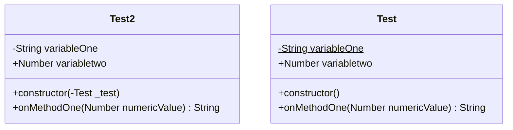

```mermaid
classDiagram
class Test2
class Test
Test : -String variableOne$
Test : +Number variabletwo
Test : +constructor()
Test : +onMethodOne(Number numericValue) String
Test2 : -String variableOne
Test2 : +Number variabletwo
Test2 : +constructor(-Test _test)
Test2 : +onMethodOne(Number numericValue) String

```