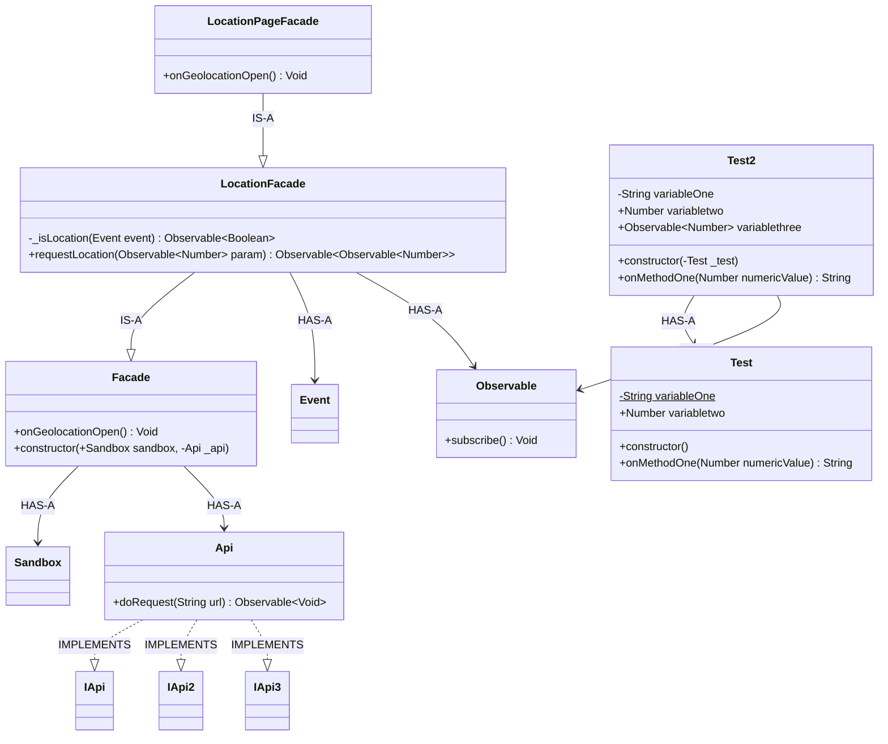

```mermaid
classDiagram
class LocationPageFacade
class LocationFacade
class Facade
class Api
class Sandbox
class Observable
class Test2
class Test
Test : +constructor()
Test : +onMethodOne(Number numericValue) String
Test : -String variableOne$
Test : +Number variabletwo
Test2 : +constructor(-Test _test)
Test2 : +onMethodOne(Number numericValue) String
Test2 : -String variableOne
Test2 : +Number variabletwo
Test2 : +Observable~Number~ variablethree
Observable : +subscribe() Void
Api : +doRequest(String url) Observable~Void~
Facade : +onGeolocationOpen() Void
Facade : +constructor(+Sandbox sandbox, -Api _api)
LocationFacade : -_isLocation(Event event) Observable~Boolean~
LocationFacade : +requestLocation(Observable~Number~ param) Observable~Observable~Number~~
LocationPageFacade : +onGeolocationOpen() Void

Test2 -->  Test:HAS-A
Test2 -->  Observable~Number~:HAS-A
Api ..|>  IApi:IMPLEMENTS
Api ..|>  IApi2:IMPLEMENTS
Api ..|>  IApi3:IMPLEMENTS
Facade -->  Sandbox:HAS-A
Facade -->  Api:HAS-A
LocationFacade --|>  Facade:IS-A
LocationFacade -->  Event:HAS-A
LocationFacade -->  Observable~Number~:HAS-A
LocationPageFacade --|>  LocationFacade:IS-A

```